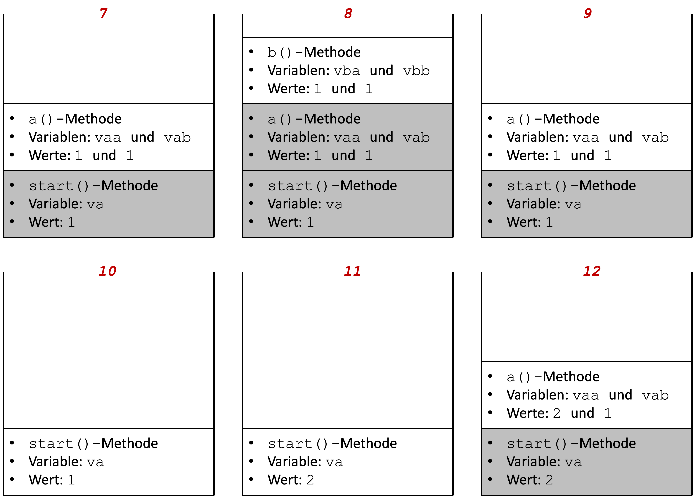
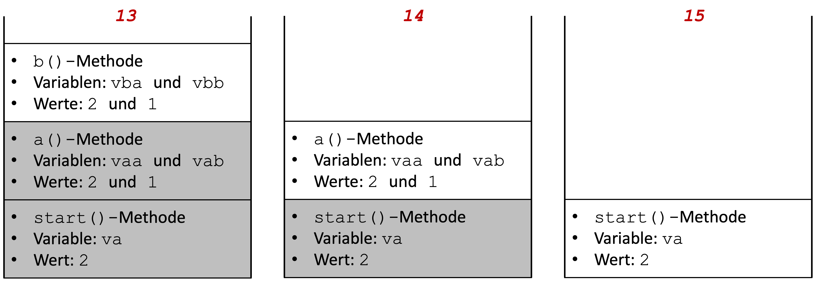

# Methodenstack

Programme und die dazugehörigen Variablen (und deren Werte) befinden sich zur Ausführung im Arbeitsspeicher. Der Speicher ist in Blöcke (Bytes) unetrteilt, die jeweils adressierbar sind. So könnte alles jeweils eine Adresse zugeordnet werden und mit einer komplexen Adressverwaltung ließen sich die Einzelteile ansprechen. Das ist jedoch viel zu aufwendig und inperformant. Deshalb werden Speichermodelle verwendet, die die Verwaltung der Programmteile erleichtern. Ein solches Speichermodell ist der *Stack* (*Stapelspeicher*). 

Bei einem Stack gilt das *Last in first out (LIFO)* Prinzip, also das, was zuletzt in den Stack kam, muss auch als erstes wieder hinaus. tatsächlich gibt es nur ganz wenige Funktionalitäten, um einen solchen Stack zu verwalten: 

- `push`: Element oben auf den Stack hinzufügen 
- `pop`: Element von oben aus dem Stack entfernen
- `top` (manchmal auch `peek` genannt): auf oberes Element zugreifen (lesen, aber im Stack belassen)

Folgende Abbildung stellt diese Methoden grafisch dar:


Für einen solchen Stack gibt es jetzt nur drei Möglichkeiten:

- Element `E` kann gelesen werden (aber im Stack belassen) - `top`
- Element `E`kann aus dem Stack entfernt werden - `pop`
- ein neues Element (z.B. `F`) kann zum Stack hinzugefügt werden - `push` (dann kann auch `E` nicht mehr gelesen werden; so wie bereits `A`-`D`)


## Abarbeitung von Methoden

Wir betrachten das Speichermodell *Stack*, weil die Abarbeitung von Methoden nach diesem Prinzip funktioniert. Methoden, die abgearbeitet (aufgerufen) werden, werden in einem solchen Stack angeordnet. Wir betrachten ein Beispiel:

=== "Methodenstack.java"
	```java linenums="1"
	public class Methodenstack
	{
		public static void a(int vaa)
		{
			int vab = 1;
			System.out.println("+--a()   --> va  = " + vaa + " vb  = " + vab);
			b(vaa, vab);
		}
		
		public static void b(int vba, int vbb)
		{
			System.out.println("+----b() --> vba = " + vba + " vbb = " + vbb);
			System.out.println();
		}
		
		public static void main(String[] args)
		{
			for(int va=0; va<3; va++)
			{
				System.out.println("main()   --> va  = " + va);
				a(va);
			}
		}
	}
	```

In diesem Beispiel gibt es drei Methoden: 

- die `main()`-Methode mit der Variablen `va`,
- die `a()`-Methode mit den Variablen `vaa` und `vab` und 
- die `b()`-Methode mit den Variablen `vba` und `vbb`.

Die `main()`-Methode ruft die Methode `a()` auf und die `a()`-Methode ruft die `b()`-Methode auf. 

Die Ausgabe des Programms ist wie folgt:

```bash
main()   --> va  = 0
+--a()   --> va  = 0 vb  = 1
+----b() --> vba = 0 vbb = 1

main()   --> va  = 1
+--a()   --> va  = 1 vb  = 1
+----b() --> vba = 1 vbb = 1

main()   --> va  = 2
+--a()   --> va  = 2 vb  = 1
+----b() --> vba = 2 vbb = 1
```

Die `main()`-Methode ruft also drei Mal (innerhalb der Schleife) die `a()`-Methode auf, welche wiederum die `b()`-Methode aufruft. 

Bei dem Aufruf von Methoden passiert folgendes:

- bei jedem Methodenaufruf wird eine **Methodeninstanz** auf den Stack gelegt
- eine **Methodeninstanz** sind alle zur Laufzeit veränderlichen Daten, die zur Methode gehören (Parameter und lokale Variablen)
- nach Abarbeitung der Methode (oft durch `return` - muss aber nicht, wie in unserem Beispiel) wird die Methodeninstanz wieder aus dem Stack entfernt (und somit auch alle dazu gehörenden Daten (Parameter, lokale Variablen und deren Werte))

In unserem Beispiel passiert also folgendes:





1. Die `main()`-Methode wird ausgeführt; die Variable `va` wird **erzeugt** und bekommt den Wert `0`. Die `main()`-Methode erzeugt eine Ausgabe auf die Konsole und ruft dann die Methode `a()` auf.
2. Die `a()`-Methode wird ausgeführt; die Variablen `vaa` und `vab` werden **erzeugt** und bekommen die Werte `0`und `1`. In der `a()`-Methode erfolgt eine Ausgabe auf die Konsole. Die `a()`-Methode ruft die Methode `b()` auf. 
3. Die `b()`-Methode wird ausgeführt; die Variablen `vba` und `vbb` werden **erzeugt** und bekommen die Werte `0`und `1`. In der `b()`-Methode erfolgt eine Ausgabe auf die Konsole. Danach ist die Ausführung der `b()`-Methode zu Ende. Alles, was mit der `b()`-Methode zu tun hat, insb. die Variablen `vba` und `vbb` werden aus dem Speicher **gelöscht**.  
4. Zurück zur Ausführung von `a()`. Keine weitere Anweisung - die Ausführung der `a()`-Methode zu Ende. Alles, was mit der `a()`-Methode zu tun hat, insb. die Variablen `vaa` und `vab` werden aus dem Speicher **gelöscht**.  
5. Zurück zur Ausführung von `main()`. Die Variable `va` bekommt innerhalb der Schleife den neuen Wert `1`. 
6. Die Variable `va` hat nun den Wert `1`. Die `main()`-Methode erzeugt eine Ausgabe auf die Konsole und ruft dann die Methode `a()` auf.
7. Die `a()`-Methode wird ausgeführt; die Variablen `vaa` und `vab` werden **erzeugt** und bekommen die Werte `1`und `1`. In der `a()`-Methode erfolgt eine Ausgabe auf die Konsole. Die `a()`-Methode ruft die Methode `b()` auf. 
8. Die `b()`-Methode wird ausgeführt; die Variablen `vba` und `vbb` werden **erzeugt** und bekommen die Werte `1`und `1`. In der `b()`-Methode erfolgt eine Ausgabe auf die Konsole. Danach ist die Ausführung der `b()`-Methode zu Ende. Alles, was mit der `b()`-Methode zu tun hat, insb. die Variablen `vba` und `vbb` werden aus dem Speicher **gelöscht**.  
9. Zurück zur Ausführung von `a()`. Keine weitere Anweisung - die Ausführung der `a()`-Methode zu Ende. Alles, was mit der `a()`-Methode zu tun hat, insb. die Variablen `vaa` und `vab` werden aus dem Speicher **gelöscht**.  
10. Zurück zur Ausführung von `main()`. Die Variable `va` bekommt innerhalb der Schleife den neuen Wert `2`. 
11. Die Variable `va` hat nun den Wert `2`. Die `main()`-Methode erzeugt eine Ausgabe auf die Konsole und ruft dann die Methode `a()` auf.
12. Die `a()`-Methode wird ausgeführt; die Variablen `vaa` und `vab` werden **erzeugt** und bekommen die Werte `2`und `1`. In der `a()`-Methode erfolgt eine Ausgabe auf die Konsole. Die `a()`-Methode ruft die Methode `b()` auf. 
13. Die `b()`-Methode wird ausgeführt; die Variablen `vba` und `vbb` werden **erzeugt** und bekommen die Werte `2`und `1`. In der `b()`-Methode erfolgt eine Ausgabe auf die Konsole. Danach ist die Ausführung der `b()`-Methode zu Ende. Alles, was mit der `b()`-Methode zu tun hat, insb. die Variablen `vba` und `vbb` werden aus dem Speicher **gelöscht**.  
14. Zurück zur Ausführung von `a()`. Keine weitere Anweisung - die Ausführung der `a()`-Methode zu Ende. Alles, was mit der `a()`-Methode zu tun hat, insb. die Variablen `vaa` und `vab` werden aus dem Speicher **gelöscht**.  
15. Zurück zur Ausführung von `main()`. Die Variable `va` bekommt innerhalb der Schleife den neuen Wert `3`. Die Bedingung der Schleife `va<3` ist somit `false`. Die Schleife wird verlassen, keine weitere Anweisung in `main()`. Die Abarbeitung des Programms ist zu Ende. Alles, was mit der `main()`-Methode zu tun hat, insb. Variable `va` wird aus dem Speicher gelöscht. 


## Lebensdauer und Sichtbarkeit von lokalen Variablen

Die Variablen, die wir bis jetzt verwendet haben, wurden in Methoden deklariert oder in Anweisungsblöcken, die in Methoden liegen (z.B. in `for`-Schleifen). Bei solchen Variablen sprechen wir von *lokalen* Variablen. Wir werden später noch *globale* Variablen kennenlernen. Zunächst interessieren uns aber nur die *lokalen* Variablen. Das obige Beispiel zeigt, dass *lokale* Variablen, also solche, die in Methoden deklariert werden, nur so lange **existieren**, wie diese Methode ausgeführt wird. Generell gilt:

> Eine Variable **existiert** in dem Anweisungsblock, in dem sie deklariert wurde, solange dieser Anweisungsblock **ausgeführt** wird. 

Schauen wir uns dazu die Situationen in dem oberen Beispiel an:

- Die Variable `va` wird in der `main()`-Methode deklariert. Die `main()`-Methode wird die ganze Zeit ausgeführt. Also existiert auch die Variable `va` die gesamte Zeit des Programmablaufs. 
- Die Variablen `vaa` und `vab` werden in der `a()`-Methode deklariert. Sie existieren immer nur dann, wenn die `a()`-Methode ausgeführt wird. In unserem Beispiel existieren die Variablen `vaa` und `vab` also drei Mal (sie werden drei Mal erzeugt und drei Mal wieder vollständig gelöscht). Da die Methode `a()` die Methode `b()` aufruft, existieren die Variablen `vaa` und `vab` auch während der Ausführung von `b()`, da zur Zeit der Ausführung von `b()` ja auch `a()` ausgeführt wird (und `main()`).
- Die Variablen `vba` und `vbb` werden in der `b()`-Methode deklariert. Sie existieren immer nur dann, wenn die `b()`-Methode ausgeführt wird. In unserem Beispiel existieren die Variablen `vba` und `vbb` also drei Mal (sie werden drei Mal erzeugt und drei Mal wieder vollständig gelöscht). 

Die Lebensdauer eine Variable wird somit von der Ausführungsdauer des Anweisungsblockes bestimmt, in dem die Variable deklariert wurde. 

!!! note "Lebensdauer"
	Es ist eine gängige Praxis, alle Variablen, die man in einer Methode verwenden möchte, am Anfang der Methode zu deklarieren. Erstens sieht man dann, welche Variablen innerhalb der Methode alle verwendet werden und zweitens kann man diese Variablen in allen Anweisungsblöcken innerhalb der Methode verwenden. Einzige Ausnahme stellen Laufvariablen der `for`-Schleifen dar. Diese werden häufig direkt in der `for`-Schleife deklariert (`for(int i=0, i<10; i++){}`). Sie existieren dann aber auch nur in dieser `for`-Schleife! Außerhalb der `for`-Schleife existiert diese Variable dann nicht (mehr)! Das bedeutet auch, dass wenn Sie diese Variable in einer anderen `for`-Schleife verwenden wollen, müssen Sie sie dort erneut deklarieren. 

Unter *Sichtbarkeit* einer Variablen versteht man die Möglichkeit, auf diese Variable zuzugreifen (also ihr entweder einen neuen Wert zuzuweisen oder ihren Wert auszulesen). Generell gilt:

> Eine lokale Variable ist in dem Anweisungsblock sichtbar, in dem sie deklariert wird und in allen Anweisungsblöcken, die sich in diesem Anweisungsblock befinden. Außerhalb des Anweisungsblockes, in dem die Variable deklariert wurde, ist die Variable nicht sichtbar. 

Das heißt für unser Beispiel, dass die Variable `va` nur in der `main()`-Methode sichtbar ist (also nur dort auf sie zugegriffen werden kann/sie nur dort verwendet werden kann), die Variablen `vaa` und `vab` nur in der `a()`-Methode verwendet werden können (sichtbar sind) und die Variablen `vba` und `vbb` nur in `b()`. 

!!! note "Sichtbarkeit"
	Der Vorteil dieser *lokalen* Sichtbarkeit besteht darin, dass man sich z.B. keine Sorgen machen muss, ob eine gleichnamige Variable evtl. bereits in einer anderen Methode deklariert wurde. Eine Variable darf ja immer nur einmal deklariert werden. Da alle anderen Variablen aber nicht in der eigenen Methode sichtbar sind, gibt es keinerlei Konflikte mit anderen lokalen Variablen. Die lokalen Variablen aus anderen Methoden haben mit den Variablen aus der eigenen Methode gar nichts zu tun. Außerdem ist es auch nicht möglich, einfach Werte von Variablen aus anderen Methoden zu schreiben oder zu lesen. Das würde ansonsten große Sicherheitsprobleme mit sich bringen und man könnte Programme auch leicht zum Absturz bringen. 


