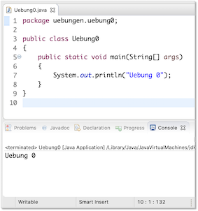

# Übungen

## Übungsblätter (wochenweise)


??? note "Übung 0"
	1. Installieren Sie sich - falls noch nicht geschehen - eine Java-Entwicklungsumgebung (siehe [**Java**](../tools/#java)).
	2. Installieren Sie sich die IDE Ihrer Wahl (siehe [**IDE**](../tools/#ide)). In den Vorlesungen und Übungen verwende ich [**Eclipse**](../tools/#eclipse) und beschreibe die Schritte auch für Eclipse.
	3. Starten Sie Eclipse durch Doppelklick auf das Programmsymbol.
	4. Erstellen Sie einen *Workspace* (Arbeitsbereich) in einem gewünschten Ordner (z. B.
	`Prog12`) im Dateisystem. Achten Sie darauf, dass Sie Schreibrechte in diesem Ordner besitzen.
	5. Anlegen eines Projektordners:
		* Auswahl im Menü `File-->New-->Java Project`.
		* Eingabe des `Project name:` Name des Projektes (z.B. `WiSe22`). Klicken auf den Button `Finish`.
		* Das Fenster `New module-info.java` können Sie einfach mit `Create` bestätigen.
	4. Erstellen eines neuen Packages (Paketes):
		* Öffnen der Projektmappe im `Package Explorer`.
		* Auswahl des Ordners `src` mit der rechten Maustaste.
		* Auswahl des Menüpunktes `New --> Package`.
		* Geben Sie folgenden Paketnamen ein (Paketnamen werden kleingeschrieben) `uebungen.uebung0` (Achten Sie auf den Punkt und dass Sie alles zusammen schreiben).
	5. Erstellen einer neuen Klasse:
		* Öffnen der Projektmappe im Package Explorer.
		* Auswahl des Paketes (`uebungen.uebung0`) mit der rechten Maustaste.
		* Auswahl des Menüpunktes `New --> Class`.
		* Eingabe des Namens, der gleichzeitig der Klassen- und Dateiname ist: `Uebung0`. Klassennamen werden immer groß geschrieben.
		* Setzen des Häkchens bei `public static void main()`. (Sollten Sie vergessen haben, das Häkchen zu setzen, dann ist die Klasse, nachdem Sie `Finish` gedrückt haben, leer. Setzen Sie dann den Cursor zwischen die beiden geschweiften Klammern `{ }`, geben dann `main` ein und drücken die <kbd class="key-ctrl">Ctrl</kbd><span>+</span><kbd class="key-space">Leer</kbd>-Tasten und anschließend <kbd class="key-enter">Enter</kbd>. Dann erscheint die `main()`-Methode)
		* Klicken auf den Button `Finish`.
	6. In die `main()`-Methode (zwischen die geschweiften Klammern `{` und `}` geben 	Sie ein: `System.out.println("Uebung 0"));`.
	7. Drücken Sie dann entweder auf den -Button oder 		wählen Sie aus dem Menü `Run --> Run` oder drücken Sie <kbd class="key-shift">shift</kbd><span>+</span><kbd class="key-command">command</kbd>+</span><kbd class="key-f11">f11</kbd>. In der `Console` in Ihrer IDE (in Eclipse unten) erscheint `Uebung 0`. 

	=== "Uebung0.java"
		```java
		package uebungen.uebung0;

		public class Uebung0
		{
			public static void main(String[] args)
			{
				System.out.println("Uebung 0");
			}
		}
		```

	

	!!! success
		Fertig! Ihre Entwicklungsumgebung ist bereit! Wir können loslegen. :thumbsup:

??? note "Übung 1 (Aufgabe folgt)"
